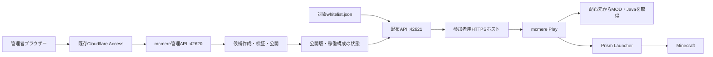

# mcmere Play — クライアント配布の設計

設計版: 1 / 2026-09-14 / 実装仕様

## 1. 決定した方針

参加者にはWindows用の **mcmere Play** を配布する。Minecraft名を一度入力すると、サーバーに合わせた専用環境を確認・修復し、Prism Launcherでゲームを起動できる。

| 項目 | 初版の決定 |
|---|---|
| 対象 | Windows 10/11 x64、Minecraft Java Edition、NeoForge。個別の対象は接続時の配布情報で指定 |
| UI | mcmereと同じReact・Lucide・WPF/WebView2。ライト／ダーク／システム設定 |
| 配布 | 通常はセットアップEXE。ZIPも用意するが、どちらも同じユーザーデータ領域を使う |
| 利用判定 | 入力名を対象サーバーのwhitelist.jsonと照合。Googleログイン・メール登録なし |
| アカウント | PlayではMicrosoft/Minecraft認証APIを実装しない。ゲーム用ログインはPrismに任せる |
| 環境 | Play専用のPrismデータ領域・インスタンス。既存.minecraftを直接更新しない |
| バージョン | Minecraft、NeoForge、管理対象MODを公開版へ固定。Javaはメジャー・CPU・承認済み配布物で管理 |
| 同期 | Playが担当。初版はpackwizを併用せず、更新処理の所有者を一つにする |
| 公開 | 管理者が確認した版を公開。サーバーへのMOD追加だけでは自動公開しない |
| 参加者の通常操作 | 「準備して参加」。確認済みなら「参加する」 |
| 参加者PCの依存 | InfraMere・mcmere管理API・.NET SDK・Node.jsは不要 |

名前の照合は本人認証ではない。登録名を知る第三者も配布を利用できることを受け入れる設計であり、デバイス認証や招待コードを追加の必須操作にはしない。ゲームの参加可否は、ゲーム側のonline-modeとホワイトリストが判定する。Prismは通常のMicrosoft/Minecraftサービスを利用するため、ゲーム用アカウントとログイン自体は必要。


### リポジトリの分離

このリポジトリは参加者アプリ、クライアント同期、Prism連携、Setup、アプリ更新とReleaseを担当する。以下のサーバー側の記述は接続先との統合仕様であり、mcmere側で実装する: 配布候補生成・検証・公開、配布API、ホワイトリスト照合、管理画面、管理CLI。

参加者アプリのプロジェクト名は`Mcmere.Play.Core`、`Mcmere.Play`、`Mcmere.Play.Setup`を基本とする。配布contractsはschema version付きの独立した境界として実装し、mcmereのデータベースや兄弟リポジトリのC#プロジェクトをクライアントから直接参照しない。共通UIのトークンを移植する場合は出典とライセンスを保持する。

ここに記載するproject、API、CLI、Setupは完成時の仕様。現在の実装範囲はREADMEとテストを参照する。

## 2. 参照構成と配布対象

説明・初期の互換性検証ではMinecraft 1.21.1、NeoForge 21.1.250、Java 21を参照構成として使う。個別サーバー名・登録ID・プレイヤー情報・ホワイトリストはリポジトリに含めず、接続時の配布情報から取得する。

有効なサーバーMODを配布候補の出発点とし、クライアント要否と依存を再評価する。プロジェクトのoptional表記だけで必要な依存を除外しない。手動追加MODは取得元・配布条件・依存・sideを確認するまで未解決として扱う。配布候補は独立したクライアントで検証してから公開する。

## 3. 参加者の導線

### 初回

1. 管理者から渡された配布ページを開く。ページにはサーバー名と「アプリをダウンロード」「アプリで開く」を表示する。
2. EXEでPlayをユーザー領域へインストールする。WebView2の不足時はMicrosoftの正規セットアップへ案内・導入する。
3. 配布ページの「アプリで開く」で対象を受け取る。アプリから配布ページURLを貼り付けても登録できる。
4. 「Minecraftの名前」で照合する。対象名・接続先・保存先を確認し、初回セットアップを開始する。
5. PlayがPrism、Java、MOD、配布対象の設定を準備する。手元のMODを再利用したい人だけ、フォルダーを選べる。
6. 初回は「Prismでログイン」を案内する。ログイン画面・アカウント選択はPrism自身が提供する。Playは認証ファイルを読んでログイン状態を判断しない。
7. PrismがMinecraft本体・NeoForge・ライブラリ・アセットを準備してゲームを起動する。初回の進捗はPrismで表示する。
8. Playは起動を引き渡したことを表示する。ゲーム参加の成功を観測していなければ「接続済み」と表示しない。

Prismの初回セットアップを完全な裏処理と表現しない。Playでの「準備完了」と、Prismでの初回取得・ログイン・ゲーム起動を区別する。

### 2回目以降

保存した名前で照合 → 公開版取得 → 差分確認 → 「準備して参加」 → 必要分を取得・検証 → 起動直前に公開版を再確認 → Prismへ引き渡す。

Playを開いただけではダウンロードや書き換えを開始しない。利用者の操作後はMODごとの確認ダイアログを繰り返さない。同期中に新しい公開版が出た場合、起動直前に差分を再計画して「構成が更新されました」を表示する。

### 名前・サーバー

- 名前は配布元とサーバーごとに保存し、「名前を変更」から修正できる。
- 大文字小文字の違いは許容し、表示はwhitelist.jsonの綴りへ統一する。
- 名前を変更した場合、管理者がホワイトリストを更新した後に新しい名前を入力する。外部プロフィール検索は行わない。
- 同じサーバーに別名を入力しても、同じ専用環境を再利用する。Prismのアカウント選択とは独立する。
- アプリに複数の配布元・サーバーを保存できる。配布元の全サーバーや全登録名を一覧公開するAPIは設けない。

### アプリで開く

導線は`mcmere-play://add?url=<URLエンコードしたHTTPSの配布ページURL>`に固定する。セットアップがユーザー単位のprotocol handlerを登録する。受信できる操作はaddだけで、URIにコマンド・ファイルパス・tokenを含めない。初回セットアップ時にプロトコルを使えない場合も、URL貼り付けで同じ登録を完了できる。

PlayはHTTPSの`/s/{publicId}`形式と入力長を検証してから、そのオリジンのinfo endpointを取得する。オリジンを跨ぐリダイレクトは拒否し、新規の配布元はホスト名とサーバー名を表示して登録する。ブラウザー側にはローカルファイルの読み取り・インストールを担当させない。

## 4. UI仕様

### 見た目

`ui/src/styles.css`のトークンを共通化して使う。白／濃いグレーの背景、薄い区切り、青い主ボタン、8pxのボタン角丸、14pxの本文、Segoe UI / Yu Gothic UI、Lucideの線アイコンを基本とする。大きな装飾画像、ゲーム風のピクセル文字、常時アニメーションは使わない。

標準ウィンドウは1080×720 DIP、最小860×600 DIP。左サイドバーはmcmereと同じ218px。高DPI、200%拡大、キーボード操作に対応し、幅が不足する詳細表は行を折り返す。画面案は会話内でも確認できるよう320px幅まで再配置する。

### 構造

- 左: `mcmere Play`、登録サーバー、サーバー追加、下部にアプリ設定。
- 右上: サーバー名、ゲーム通信の状態、名前の変更。
- サーバー内タブ: `概要 / MOD / 更新履歴 / 設定`。
- 概要: 現在の準備状態、必要な操作、主ボタン一つ、Minecraft・NeoForge・Java・MODの確認行。
- MOD: 表示名、手元の版、必要な版、必須／推奨、状態。配布候補にないMODの自由検索・追加は初版では提供しない。
- 更新履歴: 公開版の説明とローカル適用結果。サーバーログ・プレイヤー一覧は表示しない。
- 設定: 名前、メモリ、データ保存先、Prismを開く、修復、診断ログの保存。

MODのハッシュ、UUID、配布URL、例外詳細は詳細欄または診断ログへ置く。主要な表示は「不足」「更新が必要」「確認済み」。Prismが未取得のゲーム資材は「初回起動時に取得」であり、「インストール済み」とは表示しない。

### 状態と主操作

| 状態 | 主表示 | 主操作 | 補足 |
|---|---|---|---|
| 未登録 | サーバーを追加 | 配布ページを入力 | URLから対象を取得 |
| 名前未入力 | Minecraftの名前を教えてください | 確認する | 入力欄は一つ |
| 照合失敗 | ホワイトリストで名前を確認できません | 名前を確認する | 自動追加はしない |
| 確認中 | プレイ環境を確認しています | 無効 | 終了は可能 |
| 未導入 | 初回セットアップが必要です | 準備を始める | 保存先・取得見込みを表示 |
| 差分あり | MODを2個更新します | 準備して参加 | 追加・更新・退避を展開可能 |
| 同期中 | MODを取得しています | キャンセル | 確定済みバイト数を使う |
| 切り替え中 | 更新を反映しています | 一時的に無効 | 終了要求は安全な区切りまで待つ |
| Prism初回 | ゲームの初回起動を行います | Prismを開く | ログインと本体取得の説明 |
| 準備済み | 参加の準備ができました | 参加する | 起動直前にも再確認 |
| 起動引き渡し | Prismで起動しています | Prismを開く | 接続成功を推測しない |
| 実行中を確認 | Minecraftを起動中です | 無効 | 同じ環境を書き換えない |
| ゲームサーバー停止 | サーバーは停止中です | 環境を準備する | 配布APIが正常なら同期可能 |
| 配布API不通 | 配布情報を確認できません | 再試行 | キャッシュは保持、新規同期・起動はしない |
| 同期失敗 | 更新を完了できませんでした | 再試行 | 旧環境を保持、原因を併記 |
| 構成不一致 | 配布内容の更新を待っています | 再確認 | サーバー変更後に古い版で参加させない |

確認・展開の所要量が不明な段階は不定進捗とする。単なるタイマーで完了率を作らない。必要容量は不足ファイル、展開後サイズ、退避、作業余裕を合計する。Minecraft資材が未解決なら合計を確定値と表現しない。

推奨MODは初回は管理者の推奨値を使い、MOD画面で個別選択を変更できる。変更時にも依存関係を再計算し、必須依存を外せないようにする。

## 5. 実行構成と公開境界



- 管理APIの既存Cloudflare Access/JWT/役割チェックは維持する。
- `Mcmere.Distribution.Api`を別プロセス・loopbackの別ポートで起動する。既定案は42621。外部公開は専用のHTTPSホスト一つ。
- 参加者用ホストはGoogleログインを要求しない。既存管理ホストのAccess設定を緩める方式は採用しない。
- 配布APIは公開済みの投影データと登録済みwhitelist.jsonを読む。SQLite、RCON資格情報、管理APIトークン、Cloudflareトークンを読み込まない。
- 管理プロセスだけが投影データを生成する。投影には公開設定、公開版の参照、サーバー構成の状態、対象ホワイトリストの絶対パスを含める。絶対パスを外部のレスポンスへ出さない。
- 配布APIのプロセス分離はルート分離であり、同じWindowsユーザーで動かす場合にOS権限まで分離できたとは扱わない。
- ルート指定のない配布ホスト、任意ファイルの配信、任意URLへのプロキシ、管理用`/api/*`は404にする。
- 初版では独自MODの小規模配布をローカルストレージから行う。Modrinth等の公開MODは原則として元のCDNから直接取得する。
- 公開先ホスト名は実装時の運用設定値。設計段階ではDNS・Tunnel・Accessを変更しない。

### 追加する単位

| 単位 | 責任 |
|---|---|
| `Mcmere.Distribution.Contracts` | manifest、公開状態、エラー、schema version。サーバー資格情報を持たない |
| 既存`Mcmere.Core`の配布サービス | 候補生成、依存解決、公開ジョブ、署名、稼働構成との対応 |
| `Mcmere.Distribution.Api` | 名前照合、短期セッション、公開版・対象ファイルの読み取り専用配信 |
| `Mcmere.Play.Core` | 環境診断、同期計画、ダウンロード、トランザクション、Prismアダプター |
| `Mcmere.Play` | WPF/WebView2、ネイティブ操作窓口、セットアップ後の起動 |
| `ui`内のPlayエントリーポイント | 管理UIとトークン・基本部品を共有する参加者画面 |
| 管理UIの「クライアント配布」 | 候補、公開版、ファイル分類、検証記録、配布ページ、公開停止 |

既存`JavaRuntimes`や`Downloads`の処理は再利用可能な部分を抽出する。ただし管理サーバー用のホスト許可リストや保存先を参加者へそのまま適用しない。

## 6. 名前照合と短期セッション

1. `POST /v1/servers/{publicId}/sessions`へ`playerName`を送る。
2. 前後空白を除去し、`^[A-Za-z0-9_]{3,16}$`を検証する。
3. 設定済みのwhitelist.jsonを読み、OrdinalIgnoreCaseで一致する名前を検索する。
4. 一致するUUIDが有効か検証し、正規の綴りとUUIDへ内部で紐付ける。重複名・矛盾したUUID・JSON破損は照合不能として閉じる。
5. ランダム32バイトのopaque tokenを発行する。有効期限は15分、スコープは配布元内の一つのサーバー。本人証明ではなく配布リクエスト用の短期状態。
6. tokenはメモリ上のみで保持し、失効時には保存名で自動再照合する。サーバー再起動でセッションが失われても利用者の再入力は不要。

各manifest取得、起動確認、ホスト配信ファイルのリクエスト時に、UUIDと保存名が現在のホワイトリストにあることを再確認する。期限内tokenだけで削除後の新規取得を許可しない。既に開始した転送やCDNからの取得、手元のファイルは取り消せない。

ファイル読取失敗を未登録扱いにせず503で返し、「今は確認できません」と表示する。名前不一致は403、書式不正は400、失効は401。ホワイトリストの全件、他の入力候補、OP/BAN情報を返さない。

初期レート制限は照合がIPあたり10回/分・burst 5、tokenあたりメタデータ60回/分。共有回線を考慮して調整可能とし、429はRetry-Afterに従う。名前とUUIDをアクセスログへ常時出さず、サーバー・結果・時刻を記録する。記録する名前は「申告名」であり「認証済み利用者」と呼ばない。

## 7. 配布版のモデル

一つの版は変更不可のmanifestと検証記録から成る。表示用ラベルとは別に、serverIdごとの単調増加`sequence`とランダムな`releaseId`を持つ。配布先を返す短期URLやtokenはmanifestの署名対象へ含めない。

必須フィールド:

| 分類 | フィールド |
|---|---|
| 識別 | schemaVersion、releaseId、sequence、serverPublicId、createdAt |
| 説明 | displayVersion、title、plain-text changelog |
| 互換 | minimumPlayVersion、supportedPrismRange、minecraftVersion、loader kind/version |
| Java | major、architecture、runtimeCatalogId。配布物の版・URL・SHA256は承認済みruntime catalogで解決 |
| 構成 | serverFingerprint、clientFingerprint、files |
| ファイル | fileId、relativePath、size、sha512、modIds、versionLabel、source、requirement、requiredBy、updatePolicy |
| source | Modrinth project/version/file、承認済み直接URL、またはgateway blob ID |
| Java以外の設定 | recommendedMemoryMiB、gameEndpoint、配布対象の設定／リソースパック |

ハッシュはファイルの正確なbytesを対象にする。JAR名やversionLabelを一致の根拠にしない。Modrinthから解決した場合も、実際のサーバーファイルのSHA512と一致するファイルを選び、同じversion内のprimaryファイルを無条件で選ばない。

manifestはUTF-8の生成済みbytesに対するRSA-PSS/SHA-256の分離署名を付ける。keyId、signature、manifest hashをenvelopeへ置き、クライアントは再シリアライズせず受信bytesを検証する。署名鍵は管理プロセスだけが保持する。Gatewayに秘密鍵を置かない。

最初の配布ページはHTTPSを信頼の起点とし、配布元オリジンと公開鍵を保存する。未知の配布元を追加するときだけホスト名を表示する。HTTPS経由の初回取得以上の本人保証は主張しない。鍵の更新は旧鍵で署名された新鍵を受け入れ、旧鍵が失われた場合は配布元を再登録する。

新しい有効版の選択はオンラインAPIで行い、署名だけでは古い版の起動を許可しない。sequence低下を検出する。以前の構成に戻す場合は同じファイルを参照する新sequenceの版を発行する。

## 8. サーバーから公開版を作る

1. 管理者が対象サーバーの「クライアント配布」から「現在の構成で候補を作成」。通常のジョブとして202/jobIdを返す。
2. サーバーごとの既存ジョブ直列化に参加し、Minecraft/loader、実際の有効JAR、指定した共有設定を収集する。サーバーの停止は候補作成だけでは行わない。
3. DBの記録とディスクのJAR名・ハッシュを突き合わせる。未登録JAR、欠落、無効化の食い違いは候補の未解決項目にする。
4. ファイルを読む前後の構成とハッシュを確認する。途中で構成が変わった場合は候補作成をやり直す。DB revisionだけで安定したsnapshotと判断しない。
5. クライアント要否・依存・取得先・配布条件を解決し、未解決項目を管理者が補完する。
6. テスト用のパックを作り、管理者が独立したPrismインスタンスでゲーム起動・サーバー接続を確認する。管理者用Access経由で候補を取得でき、未公開の候補を参加者APIには出さない。
7. テストしたcandidate hash、日時、担当者、結果を保存する。候補の内容が変われば検証記録を無効化する。
8. 「この版を公開」で実ファイル・稼働構成・検証記録を再確認し、署名済み版を書き込んでから現在版の参照を原子的に切り替える。

### MODと依存

- 分類は`必須 / 推奨 / 配布対象外 / 未確認`。分類の根拠と手動指定をversion/hash単位で保存する。
- プロジェクト単位のclient-side情報は初期候補の材料。選択版のmetadata、JAR内のMOD情報、依存を突き合わせる。
- 必須MODのクライアントで必要な依存は必須へ昇格する。推奨MODを選んだ場合も推移的依存を含める。
- JAR一つが複数modIdを提供すること、埋め込み依存、NeoForgeのside指定、version range、競合・非互換を扱う。TOMLの単純な正規表現解析だけで確定しない。
- サーバー専用依存をクライアントへ機械的にコピーしない。クライアント専用依存は配布候補側に追加できる。
- 未確認を「たぶん不要」として自動除外しない。必須を除外する手動指定は依存検証に反するなら公開不可。
- 手元JARは正規の入手先と配布条件を登録する。取得自動化が認められない配布物は「配布ページを開く→ファイルを選択→ハッシュ照合」の手動取得を明示する。初版パックの必須ファイルにこれが残る場合、完全自動導入とは案内しない。

### 設定ファイル

`config`等は管理者がファイル単位で選択する。既定は何も配布しない。`server.properties`、whitelist、ops、BAN、ログ、ワールド、RCON・連携資格情報は候補生成の対象外。

ポリシーは二つに限定する。`managed`は公開版に合わせて更新・退避、`seed`は初回だけ配置して以後保持する。options.txt、キー設定、スクリーンショット、savesは常にユーザー所有。サーバー側で自動同期される設定を無条件に二重配布しない。

### 稼働版とのずれ

`serverFingerprint`はMinecraft、loader、有効なサーバーJAR、指定した共有設定から計算する。クライアント専用ファイルを含む`clientFingerprint`とは別。

管理プロセスはMOD/実行環境の変更開始時に配布の起動許可を停止し、ジョブ完了・正常起動・fingerprint一致後に再評価する。外部からの書換えには監視と定期走査を併用する。初期値は10秒ごとの状態投影、60秒ごとの完全ハッシュ再確認、最終確認から90秒を超えた投影はstale。

ディスクの状態だけではメモリ上で稼働するMOD構成を証明できない。起動時のfingerprintと現在のディスク状態の一致、再起動待ちなしを起動許可の条件にする。未知の起動状態は管理者の確認／正常再起動まで未確認とする。外部変更の検出には上記の遅延があり、瞬時の保証はしない。

管理API停止・投影stale・サーバー構成不一致でも、既存の公開版の閲覧／準備は可能とするが、「参加する」の新規引き渡しは止める。配布自体を管理者が停止した場合は新規のmanifest／blob取得も止める。

## 9. クライアントの同期と所有範囲

保存先の初期値は`%LOCALAPPDATA%\mcmere-play`。アプリ本体の更新とゲームデータを分離する。

```text
mcmere-play/
  app/                         Play本体と固定された実行資材
  settings.json                配布元、入力名、表示設定
  runtimes/prism/<version>/    検証した公式Prism portable
  runtimes/java/<artifactId>/  承認済みJava
  prism-data/                  Play専用Prism設定・認証状態
    instances/<instanceId>/
      instance.cfg
      mmc-pack.json
      .minecraft/
  state/<instanceId>/          適用済みmanifest、履歴、transaction journal
  cache/sha512/               検証済み配布ファイル
  staging/<transactionId>/    未適用ファイル
  backups/<instanceId>/       変更した管理対象の直前2世代
  logs/                      Playの処理ログ
```

Prismの認証データはPrismが所有する。Playはその内容を読み取り・コピー・送信しない。配布パック・診断ZIP・アプリの一般バックアップにprism-data全体を含めない。

### 同期アルゴリズム

1. 対象インスタンスの排他ロックを取得。対象のPrismまたはゲームが実行中、あるいは実行状態を確認できなければファイル変更を待つ。
2. 公開版と署名を検証し、前回適用manifestと現在のファイルを比較する。管理JARは起動前にSHA512を確認する。
3. `追加 / 置換 / 管理対象から削除 / 維持 / seed済み / 未知ファイル`を計画する。重複JAR、パスの大文字小文字衝突、同一modIdの別版を検出する。
4. 取得前に容量を確認する。既存の選択フォルダーに同じハッシュのファイルがあればコピーで再利用する。ハードリンクは使わない。
5. 最大3並列でstagingへ取得する。Range/ETagが使える取得先は再開し、対応しない先ではそのファイルだけ再取得する。全ファイルをハッシュ・サイズ検証してcacheへ入れる。
6. 旧ファイルをbackupsへ退避し、管理対象の置換・削除・instance設定更新をjournalに記録して順次適用する。
7. 全変更の検証後、適用済みmanifestを最後にatomic replaceしてcommitする。複数ファイルの更新を単一のatomic操作と表現しない。
8. 起動直前に名前・現在releaseId・稼働構成を再確認してPrismへ引き渡す。

未知のJARは自動削除しない。「追加したMODが見つかりました」で対象を表示し、一括で退避して標準構成に戻せる。初版では未知JARが残る環境を「確認済み」とせず、その環境からの起動を保留する。自由なクライアントMOD追加は後続版で扱う。

キャンセルは取得・検証中に受け付け、既存の正常環境を維持する。適用中は安全な区切りまで進める。アプリ再起動時に未完了journalがあれば他の処理より先に回復し、commit前は元へ戻す。commit後の中断は新状態を検証して確定する。回復できない場合は起動を止め、対象を表示する。

旧2世代は新しい適用成功後に整理する。容量不足を理由に先に旧世代を消さない。個人設定とセーブは切り戻しに含めない。サーバーが要求する版より古いクライアント版を利用者だけの判断で起動する操作は用意しない。

## 10. PrismとJavaの連携

### Prismの所有範囲

公式配布の検証済みportable版をPlay専用領域へ取得し、既存のPrism設定を変更しない。実行ファイルを再利用する場合でもデータ領域は`--dir`でPlay専用へ固定する。初版の標準導線は専用portableであり、任意版のPrismとの互換性は保証しない。

対応するPrism版は、実装最初の接続検証で選定し、ダウンロードURL・SHA256・ライセンス・依存ランタイムとともにアプリのtool catalogへ固定する。都度latestを実行しない。Prism本体の更新とMODパックの更新は別操作とし、起動中にPrismを交換しない。

インスタンス形式は`instance.cfg`と`mmc-pack.json`のアダプターで生成する。Minecraft/NeoForgeのcomponent ID・設定keyは採用版のソースと実機で確認する。設定ファイルはPrismが停止している間にだけ変更し、Playが所有するkey以外は保持する。任意の配布manifestからPrism設定・JVM引数・起動フックを注入できないようにする。

起動は`ProcessStartInfo.ArgumentList`を使い、shellを経由しない。

```text
prismlauncher.exe --dir <Play専用Prism領域> --launch <instanceId> --server <接続先>
```

`--profile <name>`は利用者が指定したPrismアカウントを選ぶ補助として使えるが、名前の所持を証明するものではない。標準はPrismで対象アカウントを選択してインスタンスに保存する。入力名と違うゲームアカウントで接続した場合の最終判定はサーバーが行う。

Prismの起動終了コードだけでゲーム起動・接続を判定しない。専用rootに関連するPrism/Javaのプロセス生存と開始時刻を確認する。関連付けに失敗した場合は「起動状況を確認できません」として書き換えを止める。強制終了は自動では行わない。

Playが保存する初回起動済みフラグは対象インスタンスのゲームプロセスを確認した記録であり、Microsoftのログイン有効性を保証しない。認証期限切れやアカウント未選択時の再ログインは、その都度Prismが案内する。

ゲーム起動後にPlayを閉じてもゲームは継続する。Prismを直接開いて改変・起動する操作を技術的に封じる設計ではなく、Play経由での同期品質を保証する。

### Java

Playがゲーム用Javaを取得し、対象インスタンスのJavaPathへ明示的に割り当てる。Prismの自動Java選択とPlayの指定が競合しないよう、採用版のOverrideJavaLocation等をアダプターで制御する。

参照構成の要求はJava 21 x64。実行ファイルの`-version`とアーキテクチャを確認する。既存の対応Javaを利用する場合も、実際に割り当てるパスを検査する。既定はPlay専用の承認済みTemurin配布物とし、システムのJAVA_HOMEやPATHは変更しない。

パッチ版はサーバーと完全一致させず、検証したJava catalogの範囲に従う。将来のMinecraft変更でJavaメジャーが変わる場合は、対応catalogを追加してから公開する。

メモリはクライアント用に決め、サーバーの8GiBをコピーしない。候補の推奨値と端末の物理／利用可能メモリから初期値を提案する。初期案は最小1GiB・最大4GiB、16GiB以上の端末には検証結果に応じ6GiBを推奨できる。これらは動作保証の必要量ではなく調整可能な初期値。

### ネイティブ操作

PlayのReact UIは同梱したローカル資材をWebView2の専用仮想HTTPSオリジンで表示する。リモート配布ページをネイティブ権限付きWebViewへ読み込まない。

bridgeは`chooseDirectory / inspect / plan / sync / cancel / launch / openPrism / exportDiagnostics`等の固定メッセージとrequestIdに限定する。発信元・JSON型・サイズを検証し、任意コマンド・任意パス・任意URLを実行する汎用bridgeは設けない。ネットワーク取得とファイル操作はC#側で行う。[WebView2の安全な設計](https://learn.microsoft.com/en-us/microsoft-edge/webview2/concepts/security)に従う。

## 11. API契約

### 参加者用ホスト

| Method / path | 内容 |
|---|---|
| `GET /s/{publicId}` | サーバー名・アプリ導入リンク。名前一覧や構成詳細なし |
| `GET /v1/servers/{publicId}/info` | 登録用のpublicId、表示名、schema、公開鍵。資格情報・MOD構成なし |
| `POST /v1/servers/{publicId}/sessions` | playerNameの照合と短期token |
| `GET /v1/servers/{publicId}/current` | token必須。releaseId、sequence、状態、署名envelope参照 |
| `GET /v1/servers/{publicId}/releases/{releaseId}` | token必須。現在公開中のmanifestと署名 |
| `GET /v1/servers/{publicId}/files/{fileId}` | token必須。現在版が参照するhosted blobのみ。Range対応 |
| `POST /v1/servers/{publicId}/launch-check` | token必須。準備したreleaseIdと現在版・ホワイトリスト・稼働構成を照合 |

currentは`distributionState=available/disabled`、`gameState=online/offline/unknown`、`compatibilityState=matched/mismatched/stale`、observedAtを別々に返す。API接続成功をゲームのonline状態として扱わない。ゲームの状態はmcmereが投影した実際の観測値を使う。

`launch-check`は起動許可の観測結果であり、ゲームへの接続チケットではない。許可後にサーバーが停止・変更される競合を完全には防げない。

metadataと認証応答は`Cache-Control: no-store`。tokenはAuthorizationヘッダーのみで渡し、URL・リファラー・診断ログへ含めない。別ホストへのリダイレクトにAuthorizationを引き継がない。

公開ファイルはfileIdから内部で解決し、相対パス指定のダウンロードAPIを作らない。URL取得はHTTPS・承認済みホスト・既定ポート、リダイレクト先まで検証する。配布元が取得用URLを返す場合も、任意のLAN/loopback/ローカルファイルへアクセスさせない。開発用loopbackは明示した開発モードだけ。

例: 名前照合応答の形（値は例）。

```json
{
  "playerName": "PlayerName",
  "sessionToken": "<opaque-token>",
  "expiresAt": "2026-09-14T01:15:00Z",
  "server": { "publicId": "<public-id>", "name": "example-server" }
}
```

エラーは`{code, message, retryable, requestId}`。stack traceや内部パスを返さない。代表codeは`name_invalid / name_not_listed / session_expired / whitelist_unavailable / distribution_disabled / release_changed / configuration_unverified / file_unavailable / rate_limited`。

### 管理API・CLI

すべて既存のadministrator権限を要求し、公開先設定の変更はownerに限定する。

| 管理API | 予定するCLI |
|---|---|
| `GET /api/servers/{id}/distribution` | `mcmere distribution show <server>` |
| `PUT /api/servers/{id}/distribution` | `mcmere distribution configure <server> --file <json>` |
| `POST .../distribution/candidates` | `mcmere distribution prepare <server> --wait` |
| `GET .../distribution/candidates/{candidateId}` | `mcmere distribution candidate <server> <candidate>` |
| `PUT .../distribution/candidates/{candidateId}` | `mcmere distribution candidate-edit <server> <candidate> --file <json>` |
| `GET .../distribution/candidates/{candidateId}/preview` | `mcmere distribution preview <server> <candidate> --out <file>` |
| `POST .../distribution/candidates/{candidateId}/validation` | `mcmere distribution validate <server> <candidate> --file <json>` |
| `POST .../distribution/releases` | `mcmere distribution publish <server> <candidate> --wait` |
| `POST .../distribution/disable` | `mcmere distribution disable <server>` |

これらは追加予定の契約であり、現行CLIではまだ利用できない。変更系はexpectedRevision、長期処理はIdempotency-Keyとjobsを利用する。公開版・候補の更新競合は409で再計画する。候補編集ではファイル分類、配布元、配布条件の確認記録、設定のポリシー、推奨メモリを更新できる。内容変更はcandidate hashを更新して以前の検証結果を無効化する。previewは登録済み資材から作る管理者用のテストパックであり、未解決ファイルを自動的に許可する経路にはしない。

## 12. 配布・更新・診断

- Playセットアップはユーザー単位。署名済みEXEを標準の配布品質とし、署名証明書は運用側で用意する。
- EXE/ZIPにMinecraft本体や参加者の認証情報を含めない。Prism等の第三者資材のバージョンとライセンスを同梱の案内へ記載する。
- Play本体の更新情報はパックとは別のアプリ配布元から取得し、署名・ハッシュ確認後にゲーム終了時へ適用する。公開MODパックから任意EXE更新を指示できない。
- パックのminimumPlayVersionを満たさない場合はアプリ更新を案内し、新形式を推測して処理しない。
- データ保存先の変更はPrismとゲーム終了後にコピー・検証してから参照を切り替える。元データの削除は成功後に別操作とする。
- アンインストールはアプリを削除し、ゲームデータは既定で残す。全データ削除を選ぶ場合だけ保存先と影響を表示する。
- ログはローカル保存、最大10ファイル×5MiB。診断書き出しは利用者操作で行い、送信は自動化しない。
- 診断にはアプリ版、OS/CPU、Java版、Prism版、匿名化したファイル差分、エラーcodeを含める。token、Prism認証ファイル、ユーザーディレクトリ名、ホワイトリスト一覧を含めない。

## 13. 実装順と完了条件

### A. Prism連携の接続検証

採用するPrism版を一つ固定し、専用root・アカウント追加・Minecraft 1.21.1・NeoForge 21.1.250・Java 21の割当・指定サーバー起動を独立した環境で確認する。component ID、Java override、初回取得、終了コード、実行中判定を記録する。

ここは設計の未選択肢ではなく、外部アプリとの境界を確かめる最初の実装工程。公開CLIで確認できない進捗をPlayで表示する実装は、この結果が出るまで作らない。

### B. 配布版・名前照合

contracts、候補生成、未解決項目、署名、投影、独立Gateway、名前照合と再照合を実装する。Google認証なしの配布ホストから管理APIへ到達できないことを検証する。

### C. 同期エンジン

Java・Prism準備、ハッシュによる再利用、依存、差分、取得再開、容量検査、退避・journal回復、排他を実装する。UIより先に異常終了時のデータ保持をテストする。

### D. UIと管理画面

Playの初回・概要・MOD・履歴・設定と、mcmereの候補・検証・公開を実装する。実測進捗、キーボード、テーマ、拡大、長いMOD名を確認する。

### E. example-serverでの受け入れと配布

手動追加MODの入手先・配布条件・依存・sideを確定し、初回パックをテストする。クリーンな別PCで導入・ログイン・起動・参加を確認した版を公開する。稼働サーバーの更新・再起動や外部公開の変更はこの設計作業に含めない。

### 必須の受け入れ項目

| ケース | 期待結果 |
|---|---|
| Java/Prism/MODがないPC | 名前入力から必要な資材を用意し、Prismログイン後に接続できる |
| 異なるJava・NeoForge・MOD | 指定インスタンスの実際の設定とファイルが公開版へ揃う |
| 同名だが内容の違うJAR | ハッシュで不一致として修復する |
| Kotlin等の推移的依存 | optionalというプロジェクト表記だけで欠落しない |
| server-only / embedded / client-only依存 | 不要な導入・二重導入・欠落がない |
| 未登録名・case違い・不正入力 | 403・成功・400をそれぞれ返す |
| 照合後にホワイトリスト削除 | 期限内tokenでも新しい配布要求とlaunch-checkを拒否 |
| whitelist読取失敗・不正JSON | 未登録と断定せず一時的確認不能 |
| Googleログインなし | 配布の導線が完結する。管理画面は既存認証を維持 |
| 入力名とPrismアカウントが異なる | 本人認証済みと表示しない。ゲーム参加はゲームサーバーが判定 |
| 別server token / 非公開候補 / 任意パス | 取得不可 |
| 署名・ハッシュ不正 / 不正ZIP / リンク / 大小文字衝突 | 現行環境を変更せず拒否 |
| 通信断・容量不足・途中キャンセル | 旧環境と検証済みキャッシュを保持 |
| 適用中に強制終了 | 再起動時にjournalから回復し、混在状態で起動しない |
| 同期中の公開版変更 | 起動前の再確認で差分を再計画 |
| MOD変更後の再起動待ち / stale投影 | 古い構成での新規起動引き渡しを止める |
| 同じ環境をPrism/ゲームで使用中 | 更新が待機し、設定やJARが壊れない |
| options.txt、saves、スクリーンショット | 更新・切り戻しを通して保持 |
| 長い日本語パス・空白・200% DPI | 起動、ファイル操作、UIが正常 |
| Play終了・更新・アンインストール | ゲームを自動強制終了せず、既定でデータを保持 |

## 14. 初版で扱わないもの

macOS/Linux/ARM版、Microsoft認証の独自実装、管理APIへの参加者権限付与、名前所持の証明、公開MODのコピー防止、任意ランチャーへの同期、手元の.minecraft全体の置換、自由なMOD追加・自動互換性保証、参加者単独での古いパック起動、ゲーム内サーバー構成の自動変更。

## 15. 根拠と外部境界

- 既存UI: [styles.css](https://github.com/octopusv/mcmere/blob/main/ui/src/styles.css)、[App.tsx](https://github.com/octopusv/mcmere/blob/main/ui/src/App.tsx)。既存デスクトップ: [MainWindow.xaml.cs](https://github.com/octopusv/mcmere/blob/main/src/Mcmere.Desktop/MainWindow.xaml.cs)。
- 既存データ: [Models.cs](https://github.com/octopusv/mcmere/blob/main/src/Mcmere.Core/Models.cs)、[Mods.cs](https://github.com/octopusv/mcmere/blob/main/src/Mcmere.Core/Mods.cs)。公開境界: [RequestSecurity.cs](https://github.com/octopusv/mcmere/blob/main/src/Mcmere.Api/RequestSecurity.cs)。
- Prismは独立したデータ領域、インスタンス指定、サーバー指定、アカウント指定、ZIPインポートのCLIを公開している。[Prism CLI](https://prismlauncher.org/wiki/getting-started/command-line-interface/)
- PrismはJava自動管理を持つが、初版ではPlayが明示的に割り当てる。[Prism Java](https://prismlauncher.org/wiki/getting-started/installing-java/)
- 配布物は公式Windowsダウンロードから採用版を選ぶ。[Prism Windows](https://prismlauncher.org/download/windows/)
- Javaのoverride、メモリ、インスタンスアカウント等はPrism側の設定であり、採用tagへ固定したadapter試験を必要とする。閲覧時点のdevelopを製品の互換性保証にはしない。[Prism MinecraftInstance](https://github.com/PrismLauncher/PrismLauncher/blob/develop/launcher/minecraft/MinecraftInstance.cpp)

本書の設計と画面案は実装前の仕様。実機でのPrism連携、手動追加MODの配布条件、署名証明書・公開ホストの設定、完成したクライアントパックの接続検証は、実装・公開時に完了を確認する。
